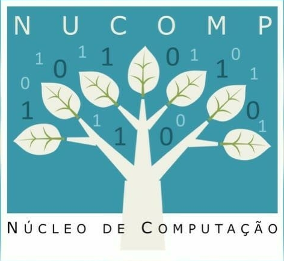

<p align="center">
    <a href="https://www2.uea.edu.br" target="blank"></a>
    <a target="_blank"></a>
</p>

<h1 align="center"> Descrição do Projeto </h1>

<p align="center">Simulador de horas complementares para o site do curso de Engenharia de Computação, Sistemas de Informação e Licenciatura em Computação.</p>

<h2 align="center"> Tecnologias Utilizadas </h2>

<p align="center">
	<a href="https://www.python.org"></a>
	<a href="https://fastapi.tiangolo.com"></a>
	<a href="https://www.mongodb.com/pt-br"></a>
	<a href="https://www.docker.com"></a>
	<a href="https://python-poetry.org"></a>
</p>

### Pré-requisito:

* Será necessário criar a imagem da API utilizando o Docker;

* O repositório com o Dockerfile (necessário para criar a imagem da API) poderá ser encontrado no seguinte link:
    * <a href="https://github.com/NUCOMP-UEA/Simulador-de-horas-API">API do Simulador de Horas;</a>
    * O Dockerfile estará na branch **feat/activity-crud**, na **raiz do projeto**.

### Execução do comando no terminal para subir a imagem da API

```zsh
docker compose up -d && docker logs add_hours_api -f
```